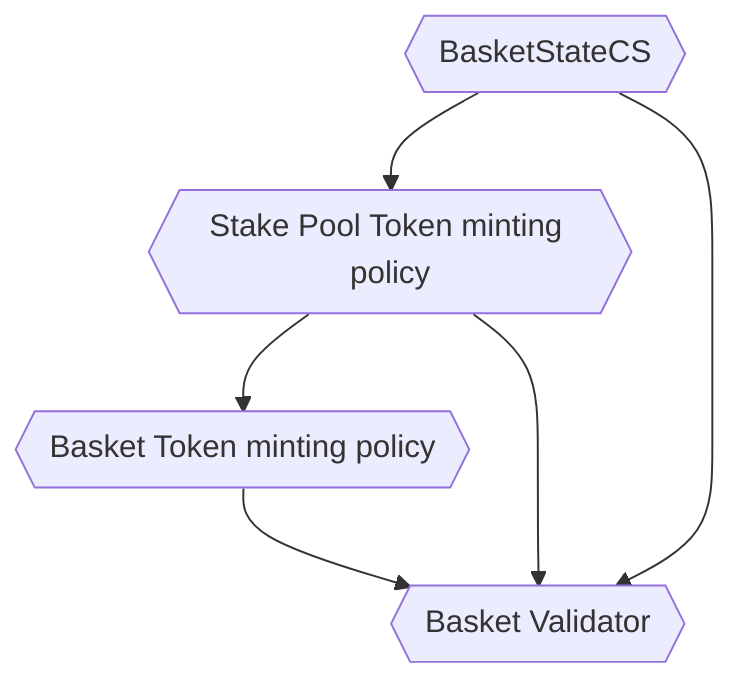
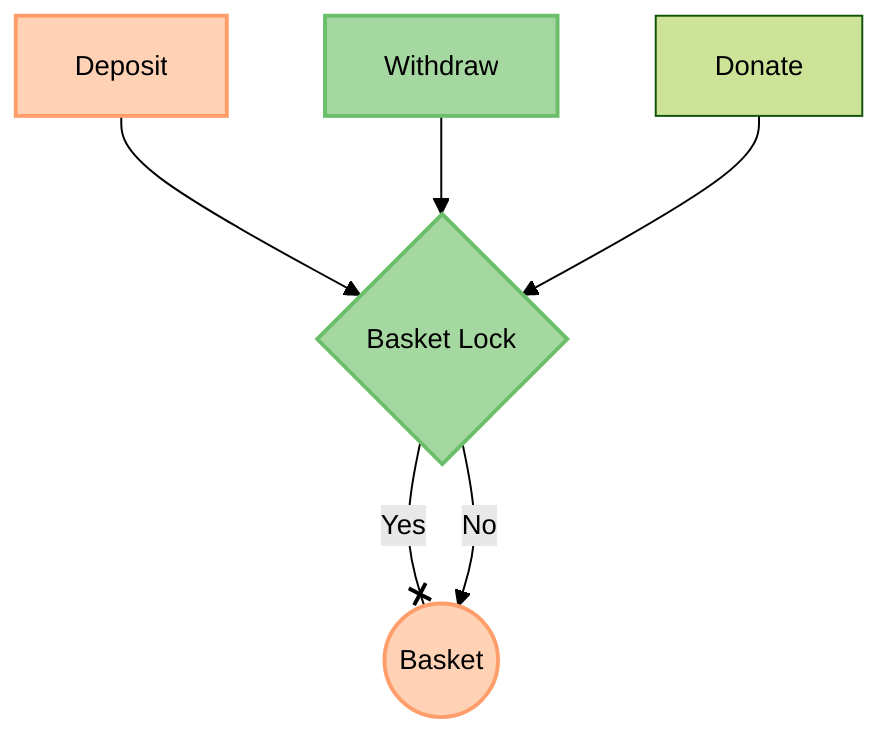
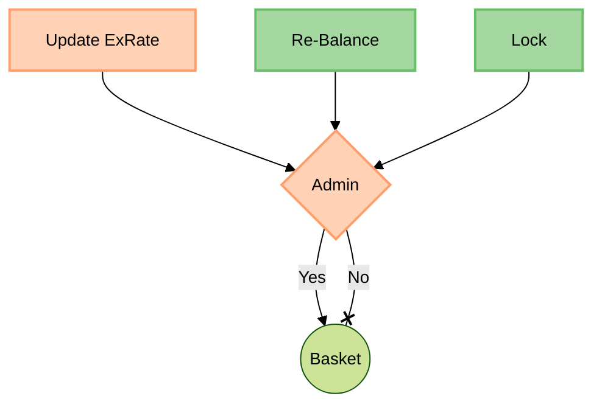

# Staking baskets

Staking Baskets offer an innovative solution for ADA holders looking to maximize their participation in the Cardano network's staking ecosystem. These staking baskets provide users with the ability to create diversified staking portfolios, a feature that sets them apart in the realm of blockchain staking. 

These Staking Baskets allow users to spread their ADA holdings across multiple stake pools. Instead of delegating their entire ADA balance to a single pool, users can distribute it among various stake pools within a single basket. This diversification strategy reduces the risk associated with relying on a single stake pool's performance and enhances the potential for consistent staking rewards.

To facilitate this process, Staking Baskets introduce a unique class of tokens for each basket. These tokens are fungible and represent the user's stake in a specific basket. Initially, the exchange rate for these tokens is fixed, but it evolves as the basket accumulates staking rewards. Users receive these basket tokens when they deposit ADA into a particular basket, and they can redeem them for ADA at a rate that considers the rewards earned by the basket.


## Safety Guarantees:

1. **Deposits Protection:** The protocol ensures that users retain the capability to retrieve their deposited ADA in full. They can do it in any time while the basket is not locked.
The basket always have enough liquidity to allow wihdrawal for all issued BasketTokens (i.e. witdrawal of all deposits).
This means users have the confidence that they can always recover their initial ADA deposits without any loss.

2. **Monotonically growing Exchange Rate:** Once the exchange rate of the basket token is increased, it remains never decreases. This guarantees that users, upon depositing ADA into a basket, can always expect a consistent and monotonically growing exchange rate for their basket tokens.

It's worth noting that while the protocol safeguards the users deposits and exchange rates, it's important to recognize that the actual rewards earned by the baskets rely on the actions of the administrator. Administrators are responsible for withdrawing staking rewards generated by the baskets from stake pools and depositing them into the baskets. While the protocol does not guarantee the earning of rewards, it aims to provide a fair and transparent mechanism for reward distribution. Malicious actions by administrators, such as potential reward mismanagement is a possibility. Users should exercise due diligence in selecting trustworthy administrators to maximize their staking rewards.

## Technical Specification of Staking Baskets

## High level design

### Basket tokens and exchange rates

Each basket script has a unique, fungible Basket Token. Users are paid with Basket Tokens in return for depositing ADA.

Over time the basket starts earning Cardano staking rewards and the exchange rate of its basket tokens will be equal to the total ADA deposited plus accumulated staking rewards divided by the total basket tokens issued. Since rewards are only earned at the beginning of each epoch the basket token exchange rate remains fixed within each epoch. For example:

| Epoch | TVL (Lovelace) | Basket tokens | Exchange rate |
| ---  | --- | --- | --- |
| 0 | 100,000 | 100,000 | 1.00000 ADA / BT |
| 1 | 100,052 | 100,000 | 1.00052 ADA / BT |
| 2 | 100,108 | 100,000 | 1.00108 ADA / BT |
| 3 | 100,170 | 100,000 | 1.00170 ADA / BT |

Basket tokens are minted and paid to users when they deposit ADA into the basket script according to current *exchange rate*. For instance, given an exchange rate of 1.0, a user's deposit of 1,000 Lovelace is equivalent to 1,000 basket tokens.  Later on, the user can burn his basket tokens and obtain ADA back at current *exchange rate*, which takes into account the staking rewards earned by the basket.

Reward period starts when new Cardano epoch is entered. 
During the reward period the bots collect staking rewards accrued by Cardano and then put them back in the basket and update the exchange rate.

### Pledge Basket

A pledge basket is a unique type of basket where users commit their deposits for a specified duration. During this pledge period, users are unable to withdraw their deposits. However, as compensation for making this commitment, they receive additional staking rewards from Cardano that they would not have earned if they had deposited their funds in a standard basket.

The pledge mechanism essentially leverages the existing locking mechanism with one key distinction: an active pledge lock, which, unlike a regular basket lock, blocks withdrawals while still permitting deposits. The pledge lock state, along with the basket lock state, is stored in the BasketState UTxO. These two lock states operate in accordance with similar rules, albeit with different time parameters.

## Script dependency graph

That's a dependency graph of scripts that one encounters trying to initialize the basket. The dependencies here are in a sense that a dependency of two scripts is implied by a dependency of a parameter of one scripts on a Currency Symbol of another script. All scripts directly or indirectly depend on the Currency Symbol of the NFT which makes them unique per basket.



There are also runtime dependencies:
- provided a Basket State UTxO (reference) input any script can deduce the Basket Validator's address
- provided a Stake Pool UTxO (reference) input any script can deduce the Basket Validator's address

E.g., this fact is leveraged when creating Stake Pool UTxOs and on other occasions.

## Basket's onchain representation

A basket is represented onchain by a following set of UTxOs:

- one *Basket State UTxO*
- many *Stake Pool UTxOs* ($\geq 1$)

All the aforementioned UTxOs belong to the same script addres. No two different baskets share the same script address.

Basket State UTxO carries following information in its datum:

- the exchange rate that is used for user's deposits and withdrawals
- the number of Stake Pool UTxOs
- the basket and pledge lock (explained in further sections)

```haskell
data BasketState
  = MkBasketState
	  { exRate :: ExRate
        -- Exchange rate of basket tokens for Coin. Common for deposits and withdrawals.
	  , numOfStakePoolUTxOs :: Integer
	    -- Number of stake pool utxos existing at the moment.
	  , lock :: BasketLock
        -- Administrator lock, that temporarily prevents users from interacting with the basket
        -- Locks have limited duration and interval, this is configured in 'BasketParams'
	  , pledgeLock :: BasketLock

	  }
```

Exactly one Basket State UTxO exists throughout the life of a basket providing the context for nearly all basket operations.

Stake Pool UTxO carries following information in its datum:

- Pub Key Hash of a stake pool the utxo delegates to - present only if the Stake Pool UTxO was assigned staking credentials
- a `basketTokenCounter`

```haskell
data StakePoolUtxoDatum
  = MkStakePoolUtxoDatum
	  { poolPkh :: Maybe PoolPubKeyHash
	  , basketTokenCounter :: Integer
	  }
```

The number of Stake Pool UTxOs is not constant and can be changed by a basket administrator any time. The protocol guarantees that the number of Stake Pool UTxOs is always greater than zero.

Users deposit to and withdraw from Stake Pool UTxOs - e.g. these UTxOs are consumed in deposit and withdrawal transactions.

The total number of basket tokens existing at a time can be computed by summing up `basketTokenCounter`s of all Stake Pool UTxOs belonging to the basket. One cannot reason about the quantity of basket tokens by looking at a subset of Stake Pool UTxOs - all of them need to be part of the computation to reveal total number of basket tokens. This protocol's invariant is expressed in pseudocode:

$\text{number of basket tokens} = \sum_{\text{utxo} \in \text{Stake Pool UTxO's set}}\text{utxo.counter}$

### Basket lock

 Exchange rate updates and rebalancing processes require multiple transactions to be executed sequentially. The basket lock prevents concurrent user transactions that could interfere with these processes, ensuring that these complex operations are atomic and complete successfully.

To achieve this transaction atomicity basket locking mechanism is used. A basket can be either in a locked or unlocked state. It's operation can be described with following rules which are enforced onchain:

```haskell
data LockingParams
  = MkLockingParams
	  { minLockInterval :: DiffMilliSeconds
		  -- Minimal time that must pass from unlocking before next lock
	  , maxLockDuration :: DiffMilliSeconds
		  -- After this amount of time from lock non-admin users can unlock basket
	  , maxTxValidityDuration :: DiffMilliSeconds
          -- Maximum duration of validity range for lock switching Tx
          -- This parameter must be significantly smaller
          -- than 'maxLockDuration' and 'minLockInterval'
          -- Too large parameter allows locking far in the future
          -- or unlocking far before 'maxLockDuration'
	  }
```

1. When a basket is locked then deposits and withdrawals are not allowed
2. The administrator has to sign a transaction that toggles the lock state
3. There is a maximal time that determines how long the basket can stay locked. If that time passes the basket can be unlocked by any one. That time is a basket parameter
4. There is a minimal time that must pass between unlocking and next locking attempt. That time is a basket parameter

In order to execute exchange rate update or rebalancing process the admin should:
- lock the basket
- wait for next Cardano block
- submit transactions in question
- unlock the basket

Locking mechanism is safe for users in a sense that it's impossible for the bot to lock the basket forever (because of 3.) or to constantly keep locking it (because of 4).

## Basket initialization

The basket validator is parameterized by a set of crucial parameters, encapsulated in the PBasketParams data type:

```haskell
data BasketParams
  = MkBasketParams
	  { adminPkh			      :: AdminPubKeyHash
		, lockingParams		    :: LockingParams
		, pledgeLockingParams :: Maybe LockingParams
		, basketStateCS		    :: BasketStateCS
		, basketTokenCS		    :: BasketTokenCS
		, stakingPoolCS		    :: StakingPoolCS
		, basketTokenTN		    :: BasketTokenTN
	  }
```

1. `adminPkh` denotes the PubKeyHash of the administrator.
2. `lockingParams` defines the locking parameters of the basket, which allow for the locking and unlocking of the basket.
3. `pledgeLockingParams` specifies the locking parameters for pledge baskets.
4. `basketStateCS` refers to the currency symbol of the unique NFT that serves to identify the basket state UTxO.
5. `basketTokenCS` corresponds to the currency symbol of the tokens that users receive when depositing their ADA.
6. `basketTokenTN` represents the token name of the tokens users receive upon depositing ADA.
7. `stakingPoolCS` is the currency symbol that identifies the stake pool UTxO.

The initialization of a basket involves several steps:

	1. Minting the NFT.
	2. Applying the BasketParams to a Basket Validator's script.
	3. Creating a Basket State UTxO at the Basket Validator's address and transferring the NFT to it.
	4. Generating the initial set of Stake Pool UTxOs carrying Stake Pool Tokens.

The basket validator's script must be parameterized by the currency symbol of the NFT from the first step. Additionally, it should be parameterized by currency symbols for Basket Token minting policies and Stake Pool Token minting policies. These minting policies themselves are further parameterized by the currency symbol of the NFT. This ensures that no scripts are shared among different baskets.

## Basket Validator Redeemers

BasketValidator redeemers purpose:

1. `Deposit`: This redeemer allows users to deposit their ADA into the basket and receive basket tokens in return.

2. `Withdraw`: Users can redeem their basket tokens for ADA using this action.

3. `UpdateExRate`: Exclusively available to the administrator, this redeemer allows the update of the exchange rate for the basket.

4. `Rebalance`: Accessible only by the administrator, this redeemer permits the adjustment of the delegation distribution among stake pools within the basket.

5. `Donate`: This redeemer enables anyone to contribute ADA to the basket. It is primarily used for depositing staking rewards.

6. `SwitchBasketLock`: This redeemer, initiated by the administrator, toggles the basket's lock status. When the basket is locked, users are unable to utilize the `Deposit` and `Withdraw` redeemers. The primary purpose of this redeemer is to facilitate maintenance operations on the basket, such as updating the exchange rate and rebalancing the delegation. Thus preventing contention of the stake pool UTxOs. Importantly, there is a maximum duration for which the basket can remain locked. If the administrator does not unlock the basket within this specified duration, any user can unlock the basket.

7. `SwitchPledgeLock`: This redeemer pertains specifically to the pledge basket. When this lock is enabled, it restricts users from withdrawing their ADA for a specified duration. Similar to the basket lock, this lock also has a maximum duration.

8. `StakePoolMPTriggerWitness`: This redeemer is used when admin wants to mint/burn a new stake pool UTxO.

### Lock Dependent Redeemers



### Admin Actions



### UpdateExRate

The exchange rate plays a crucial role in determining the conversion rate between Lovelace and basket tokens. As Cardano staking rewards accumulate and are deposited into the basket, the total ADA within the basket changes, necessitating an adjustment in the exchange rate.

To reflect this change, a recalculation of the exchange rate is performed using the following formula:

$\text{exchange rate} = \frac{\text{total ADA locked in basket's Stake Pool UTxOs}}{\text{total amount of basket tokens}}$

This recalculation involves an examination of all Stake Pool UTxOs associated with the basket's address to derive both the numerator and the denominator in the formula. The numerator is computed by summing the ADA held by these Stake Pool UTxOs, while the denominator is determined using a specific formula.

The exchange rate update process involves the creation of a new Basket State UTxO reflecting the updated exchange rate. The validity of this new exchange rate is ensured through on-chain validation. The exchange rate update transaction includes reference inputs from all Stake Pool UTxOs and a transaction input of the Basket State UTxO. The validator can independently compute the exchange rate and compare it with the value reflected in the update.

It is worth noting that the exchange rate update process is designed to occur within a single transaction to maintain atomicity. However, this approach comes with a trade-off, imposing a limit on the maximum number of Stake Pool UTxOs that can exist simultaneously, a topic that will be discussed in subsequent sections.

#### Protocol Requirements

1. [UR-001](#ur-001): Exchange rate must monotonically grow
2. UR-002: Transaction must be signed by the administrator.
3. UR-003: Basket state UTxO must be spent.
4. UR-004: Only basket state UTxO must contain basket state token.
5. UR-005: Input value and address of the basket state UTxO should not change.
6. UR-006: The `BasketState` fields should not change except for `exRate`.
7. UR-007: No tokens should be minted.
8. UR-008: `numOfStakePoolUTxOs` stake UTxOs should be referenced

##### UR-001
The exchange rate can never decrease and that follows from two facts:

- putting Cardano staking rewards back to a basket increases the amount of liquidity stored in a basket whereas the amount of basket tokens stays the same. That leads to increase of exchange rate
- rounding down in deposit and withdrawal formulas guarantee that exchanges happen at a basket's advantage. The effective exchange rate may goes ever slighty up on such occasions.

### Rebalance

The option to initiate a rebalance action empowers the administrator to achieve a desired distribution of delegation among different stake pools, ensuring that the basket's liquidity aligns with the prescribed target staking distribution at the end of every epoch.

In essence, *basket rebalancing* involves modifying the delegation of deposited ADA within a single basket. This adjustment becomes necessary due to shifts in the basket's liquidity and the need to align with the specified target staking distribution. For example, imagine a basket with three distinct stake pools: A, B, and C. The basket administrator determines that the target staking distribution should be as follows:

| A | B | C |
| --- | --- | --- |
| 20% | 15% | 65% |

Shortly before the end of an epoch, the administrator locks the basket's deposits and withdraws and reallocates the available liquidity to match this target distribution. This process might require several operations, such as:

- Assigning new staking credentials to new UTxOs.
- Transferring value from existing UTxOs to others.
- Changing the staking credentials of existing UTxOs.

For instance, consider a basket composed of the following UTxOs:

| UTxO | Staking Pool |
| --- | --- |
| 400 ADA | A |
| 350 ADA | B |
| 250 ADA | D |

To complete the rebalancing, the goal is to ensure that 20% of staked ADA is delegated to A, 15% to B, and 65% to C. Given that the total ADA in the basket is 1,000 ADA, the target distribution should be 200 ADA for A, 150 ADA for B, and 650 ADA for C.

The on-chain validation does not enforce a specific distribution outcome, but it serves to guarantee that deposits are not stolen from the basket, and that the basket remains in a consistent state. The validator approves any ADA distribution among stake pool UTxOs, as long as the mentioned conditions are met.
The basket validator's script takes care of proper passing of these authentication tokens when basket's UTxOs are consumed in various transactions.

The rebalancing transaction consumes stake pool UTxOs and produces new stake pool UTxOs with a different distribution of ADA.

#### Protocol Requirements

The rebalancing action is splitted into two different redeemers to save execution units namely:

	1. `Rebalance`
	2. `RebalanceDelegate`

##### RebalanceDelegate

	1. RB-D-001: Transaction should consume atleast one UTxO at basket validator with redeemer `Rebalance` 

##### Rebalance

	1. RB-001: Transaction should be signed by the admin.
	2. RB-002: No tokens should be minted or burned.
	3. RB-003: Sum of all values of the stake pool UTxO(s) and `basketTokenCounters` consumed should be equal to sum of all the values of stake pool UTxOs and `basketTokenCounters` in the output. In essence, these value should remain conservered.
	4. RB-004: All the `stakePoolCs` token should be present at the basket validator in the output of the transactions.
	5. RB-005: Stake pool UTxO must carry min ada value.
	6. RB-006: Staking credentials of stake pool UTxO(s) can change.

### Deposit

Users have the option to deposit ADA into a basket and, in return, receive freshly minted basket tokens. Upon withdrawal, the user relinquishes their basket tokens and receives ADA from the basket.

The deposit transaction undergoes on-chain validation in accordance with the following formula:

$\text{basket tokens} = \lfloor{\frac{\text{lovelace}}{\text{exchange rate}}}\rfloor$

Rounding in the formula is necessary for two reasons:

1. Exchange rate is a fractional and the division yields a fractional, too. Basket tokens are fungible tokens and can be nonnegative integers only. That's why rounding is a must.
2. Rounding down instead of rounding up must be used to satisfy the first protocol's safety guarantee. That is achieved by rounding down - i.e. at the basket's advantage.

In essence, the number of basket tokens to be allocated to a user is determined based on the quantity of ADA they have contributed to the basket.

The exchange rate, utilized for the calculation of the basket tokens to be minted, is sourced from the basket's state UTxO datum, known as `BasketState`. Importantly, this BasketState must be referenced within the same transaction for accurate and consistent calculations.

#### Protocol Requirements

	1. De-001: Minting of other tokens are not allowed.
	2. De-002: One input should be consumed from the basket validator address.
	3. De-003: The input should contain `stakePoolCs`.
	4. De-004: Only basket state UTxO should be present as reference input.
	5. De-005: The basket state UTxO must contains `basketStateCs`.
	6: De-006: The stake pool UTxO at basket validator have `stakePoolCs`.
	7: De-007: Deposit can only happen if the basket is unlocked.
	8: De-008: The staking credential of stake pool UTxO should not change
	9: De-009: `basketTokenCounter` should be incremented by number of basket tokens minted.
	10: De-0010: `poolPkh` of stake pool UTxO should not change.


### Withdraw

The withdrawal transaction is validated onchain according to the formula:

$\text{lovelace} = \lfloor\text{basket tokens}\cdot\text{exchange rate}\rfloor$

The ADA amount to be disbursed to a user is determined by the quantity of basket tokens that the user burns. Rounding down in this formula serves the same essential purposes as it does in the case of deposits.

The withdraw transaction closely resembles the deposit transaction. However, if a user wishes to exchange a quantity of basket tokens that would result in receiving more ADA than is locked in any individual Stake Pool UTxO, the withdrawal process must be divided into multiple transactions. To address this, the off-chain code submits transactions that consume Stake Pool UTxOs incrementally until the required amount of basket tokens has been exchanged for ADA.

This gradual withdrawal process ensures the availability of adequate ADA reserves in the associated Stake Pool UTxOs for the transaction to be successful.

#### Protocol Requirements

	1. Wi-001: Minting/Burning of other tokens are not allowed.
	2. Wi-002: One input should be consumed from the basket validator address.
	3. Wi-003: The input should contain `stakePoolCs`.
	4. Wi-004: Only basket state UTxO should be present as reference input.
	5. Wi-005: The basket state UTxO must contains `basketStateCs`.
	6: Wi-006: The stake pool UTxO at basket validator have `stakePoolCs`.
	7: Wi-007: Withdraw can only happen if the basket is unlocked and `pledgeLock` is also unlocked.
	8: Wi-008: The staking credential of stake pool UTxO should not change
	9: Wi-009: `basketTokenCounter` should be decremented by number of basket tokens burned.
	10: Wi-010: `poolPkh` of stake pool UTxO should not change.

### Donate

Any user has the option to contribute additional ADA to an existing Stake Pool UTxO. The key distinction between donations and deposits lies in the fact that, in the case of donations, users do not receive Basket Tokens in return. It's important to note that the basket lock mechanism also applies to both deposits and donations.

Donations serve a specific purpose within the protocol. They are primarily used when Cardano staking rewards are redistributed to a basket by an administrator. This contribution of ADA through donations ensures that the basket has access to additional funds, allowing it to continue participating in the staking process and accumulating rewards. The application of the basket lock to donations helps maintain consistency and fairness, preventing interactions with the basket during critical operations.

#### Protocol Requirements

	1. Do-001: Minting/Burning of other tokens are not allowed.
	2. Do-002: Basket must be unlocked for donations.
	3. Do-003: Only one stake pool UTxO can be consumed for donation.
	4. Do-004: Only one output should exist at basket validator in the transaction, namely stake pool UTxO.
	5. Do-005: `StakePoolDatum` of the consumed stake pool UTxO should not change.
	6. Do-006: Donation amount should only be in Ada and 0 < Donation.

### StakePoolMPTriggerWitness

This redeemer is employed when the administrator intends to create or burn stake pool UTxOs. It's worth noting that the checks and validation associated with this action are effectively delegated to the minting policy `StakingPoolCS`.

#### Protocol Requirements

	1. SPW-001: `stakingPoolCS` should be minted/burned in the transaction.

### SwitchBasketLock

The `SwitchBasketLock` redeemer is used in two primary scenarios:

1. **Administrator's Lock/Unlock**: The administrator employs this redeemer to either lock or unlock the basket. This action is essential when the administrator needs exclusive access to the basket for operations like rebalancing or exchange rate updates. Locking the basket prevents any deposits or withdrawals during these critical processes, while unlocking it restores normal user interactions.

2. **User's Unlock Request**: Users may also use the `SwitchBasketLock` redeemer to request the unlock of the basket. This is possible only after a specific duration of time has passed, as defined by the basket's time parameters. Once this time threshold is met, any user can initiate the unlocking process, ensuring that user funds remain accessible.

This remeeder contains `atTime :: POSIXTime` which denote when the lock was toggled.

#### Protocol Requirements

	1. SBL-001: No minting/burning of tokens
	2. SBL-002: Basket state UTxO should contain `basketStateCS` token
	3. SBL-003: There should be only 1 output at basket validator
	4. SBL-004: Basket state UTxO address must not change
	5. SBL-005: Value of basket state UTxO must remain preserved
	6. SBL-006: Transaction validity range should be within `lockingParams.maxTxValidityDuration`
	7. SBL-007: `atTime` should be within transaction validity range.
	8. SBL-008: the basket can only be locked if it's outside `minLockInterval` and the transaction is signed by admin
	9. SBL-009: The basket can only be unlocked by the user the locked duration greater than `maxLockDuration`
	10. SBL-010: Admin can unlock the basket anytime, if the basket is locked.
	11. SBL-011: `BasketState` fields should not change except `lock`.

### SwitchPledgeLock

The `SwitchPledgeLock` redeemer is used toggle the pledge lock of the basket all of the checks remain same as basket lock except the only defer by the field of `BasketState` they update.

#### Protocol Requirements

	1. SPL-011: `BasketState` fields should not change except `pledgeLock`
	
	
## Minting Policies
	
### Stake Pool Token minting policy

Stake Pool Token's purpose is to provide authenticity for Stake Pool UTxO.


Minting and burning of Stake Pool Tokens requires a signature of the admin given by `PAdminPubKeyHash`.

In the minting transaction Stake Pool Tokens must be paid to an address that is the address of a reference input which carries the Basket State Token of currency symbol `PBasketStateCS`. In other words Stake Pool Token minting policy discovers address of the basket by inspecting address of the unique Basket State UTxO.

Likewise, when Stake Pool Tokens are burnt all the assets of the corresponding Stake Pool UTxOs need to be moved to some other Stake Pool UTxO that belongs to the same basket.

### Stake Pool Token Minting Policy

```haskell
pMkStakePoolTokenMP :: BasketStateCS -> AdminPubKeyHash -> MintingPolicy
   
```
The primary purpose of Stake Pool Tokens is to ensure the authenticity of Stake Pool UTxOs.

Minting and burning Stake Pool Tokens is contingent on the administrator's signature, as provided by `PAdminPubKeyHash`.

In the minting transaction, Stake Pool Tokens must be directed to an address that corresponds to the address of a reference input carrying the Basket State Token with the currency symbol `PBasketStateCS`. In simpler terms, the minting policy for Stake Pool Tokens determines the address of the basket by inspecting the address of the unique Basket State UTxO.

Conversely, when Stake Pool Tokens are burned, all assets from the related Stake Pool UTxOs are transferred to another Stake Pool UTxO within the same basket.

#### Protocol Requirements

##### General Requirements

	1. SPMP-001: Transaction should be signed by the admin.
	2. SPMP-002: Transaction should mint/burn any other tokens.

##### When Burning `StakePoolCS`

	1. SPMP-003: There must be atleast more than 2 stake pool UTxOs as inputs.
	2. SPMP-004: There must be exactly one stake pool UTxO in the transaction output
	3. SPMP-005: The Ada value of the burned stake pool UTxOs should be transfered to other stake pool UTxO.
	4. SPMP-006: There `basketTokenCounter` of the output stake pool UTxO should be incremented by sum of all the `basketTokenCounter` of stake pools that are burned.
	
##### When Minting `StakePoolCS`

	1. SPMP-007: There must not be any stake pool UTxOs consumed.
	2. SPMP-008: The new stake pool UTxO(s) address must be same as basket validator address. 
	3. SPMP-009: The new stake pool UTxO must have min Ada value.
	4. SPMP-010: There must only `StakePoolCS` token at the stake pool UTxO 
	5. SPMP-011: The `basketTokenCounter` of new stake pool UTxO must be 0.

### Basket Token Minting Policy

```haskell
basketTokenMP ::  StakingPoolCS -> MintingPolicy
```

In the Staking Baskets protocol, each basket script features a unique and fungible Basket Token. Users receive Basket Tokens as compensation when they deposit ADA into the basket.

The Basket Token minting policy is parameterized by the Currency Symbol of the Stake Pool Token minting policy applied to its parameters. The Basket Token minting policy delegates the validation process to the Basket Validator script. This delegation is executed by verifying whether any Stake Pool UTxO is consumed in a transaction involving the minting or burning of Basket Tokens. 

#### Protocol Requirements

	1. BTMP-001: There must an UTxO present in the transaction input with token `StakingPoolCS`.

### Stake validator

Stake Pool UTxOs within the Staking Baskets protocol are designed to delegate their ADA to Cardano stake pools through the use of a Stake Validator script. The Stake Validator script is parametrized as follows:

```haskell
stakeValidator :: 
 PBasketStateCS -> PPubKeyHash -> PAdminPubKeyHash -> PStakeValidator
    
```

The Stake Validator script is uniquely defined by three parameters:

    The Currency Symbol of the Basket State Token
    The Public Key Hash that uniquely identifies a stake pool in the Cardano network
    The Public Key Hash of a basket administrator

Parametrization with both PBasketStateCS and PPubKeyHash ensures the uniqueness of the Stake Validator for a specific basket and stake pool.

The Stake Validator is utilized in the following manner:

	1. The Stake Validator script is applied to its parameters. Hereafter, "Stake Validator script" refers to the Stake Validator script that has been parameterized.
    2. The Stake Validator script is registered in the Cardano network, although it remains dormant at this stage and is not executed.
    3. The Stake Validator script is delegated to a stake pool. Activation of the Stake Validator script occurs upon delegation. The script is deemed successful if it is delegated to the precise stake pool for which the Stake Validator script was originally parameterized.
    4. Staking credentials are assigned to a Stake Pool UTxO. The staking credential is the hash of the Stake Validator script. Consequently, the Stake Validator script begins to accrue Cardano staking rewards based on the amount of ADA held within the Stake Pool UTxO and the specific stake pool for which the Stake Validator script was originally configured.
    5. Once Cardano staking rewards accumulate, the administrator is granted the ability to withdraw these rewards from the Stake Validator script. Execution of the Stake Validator script takes place during the rewards withdrawal process. The script is considered successful if the rewards withdrawal transaction is signed by the administrator initially specified in the Stake Validator script's parameters.
    6. The administrator subsequently reinvests the rewards back into the basket.
